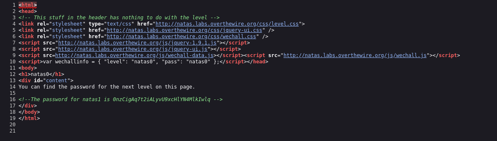

## Name: Natas Level 0 → Level 1

password:username ->
natas0:natas0

## Vulnarability: Hardcoded Credentials or Hardcoded Secrets

If we look at the source code we can see the password for natas1

## Mitigation: Dont leave your passwords in the source code, it's a bit oubious.
