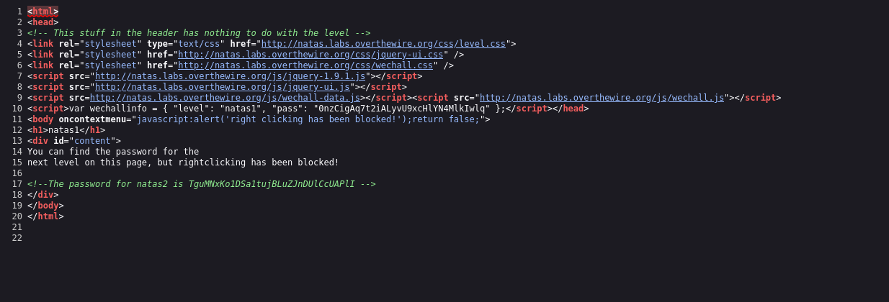

## Name: Natas Level 1 → Level 2

usernmae:password -> natas1:TguMNxKo1DSa1tujBLuZJnDUlCcUAPlI

## Vulnarability: Hardcoded Credentials or Hardcoded Secrets

If we look at the source code we can see the password for natas2

## Mitigation: Dont leave your passwords in the source code, it's a bit oubious.

