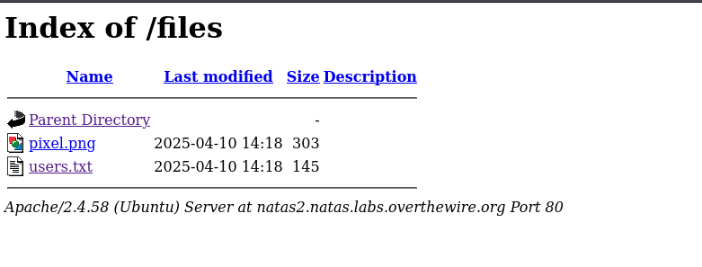

## Name: Natas Level 1 → Level 2

usernmae:password -> natas2:

## Vulnarability:

If we look at the source code we see a path to an image. "files/pixel.png" what if we take a look at the files directory!

## Mitigation: Dont leave your passwords in the source code, it's a bit oubious.

