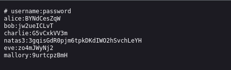

## Name: Natas Level 2 → Level 3

usernmae:password -> natas3:3gqisGdR0pjm6tpkDKdIWO2hSvchLeYH

## Vulnarability: Directory Traversal & Information Disclosure

If we look at the source code we see a path to an image. "files/pixel.png" what if we take a look at the files directory!

Then we can look at the user.txt file which will contain the users including natas3

## Mitigation: 
To mitigate this vulnerability, never store sensitive data like user credentials in plain text files within your application's accessible directories; instead, use secure secrets management solutions and implement robust input validation to prevent directory traversal.

