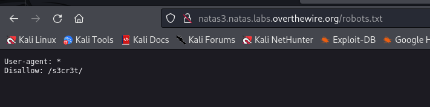
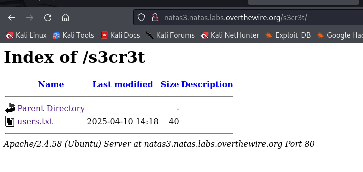
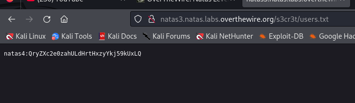

## Name: Natas Level 3 → Level 4

password:username ->
natas4:QryZXc2e0zahULdHrtHxzyYkj59kUxLQ
 
## Vulnarability:

First look at the source code we get a hint to where in the comments we see that "not even google will find it" hint meaning robots.txt

robots.txt: A robots.txt file is a text file that website owners use to communicate with web crawlers and search engine bots, indicating which parts of the website they should and shouldn't access.

We see a directory called "s3cr3t/"  lets look into that.

Another directory listing we can find the password for natas4 in the users.txt file!

## Mitigation: 

