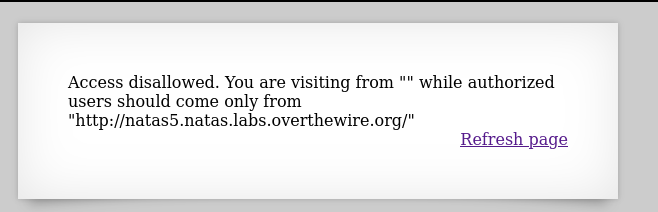

## Name: Natas Level 4 → Level 5

password:username ->
natas5:

## Vulnarability: 

In this callenge we see in the web page only users form "http://natas5.natas.labs.overthewire.org/" are allowed.

Lets intercept the traffic with a tool like burpsuite to add a referer header to make it seem like where
comming from the website "http://natas5.natas.labs.overthewire.org/".

After intercepting the traffic it should look like this after refreshing the page

Then we change the "Referer" header to "http://natas5.natas.labs.overthewire.org/".

Then after sending it back to the server we get our Access allowed and the password for the next level

## Mitigation: 

