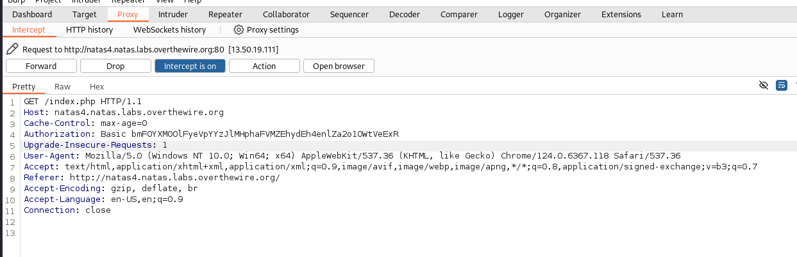
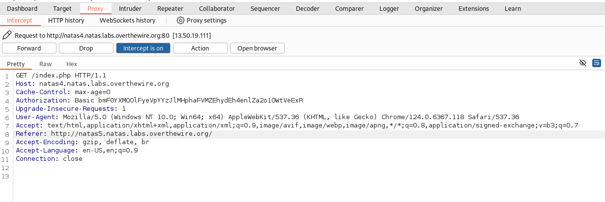
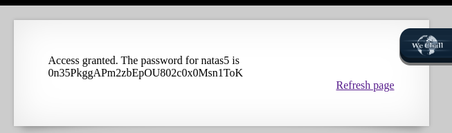

## Name: Natas Level 4 → Level 5

password:username ->
natas5:0n35PkggAPm2zbEpOU802c0x0Msn1ToK

## Vulnarability: Referer Spoofing

In this callenge we see in the web page only users form "http://natas5.natas.labs.overthewire.org/" are allowed.

Lets intercept the traffic with a tool like burpsuite to add or change the referer header to make it seem like where
comming from the website "http://natas5.natas.labs.overthewire.org/".

What is it? : The "Referer" header in HTTP requests indicates the URL of the page from which the current request originated, essentially telling the server where the user came from

After intercepting the traffic it should look like this after refreshing the page

Then we change the "Referer" header to "http://natas5.natas.labs.overthewire.org/".

Then after sending it back to the server it tricks it into thinking we are comming from the oher site, and we get our password.

## Mitigation: 
To mitigate Referer spoofing, never rely solely on the Referer header for security-sensitive decisions like authentication or access control; instead, implement stronger, server-side validation mechanisms such as anti-CSRF tokens, explicit origin checks, or session-based authentication.

