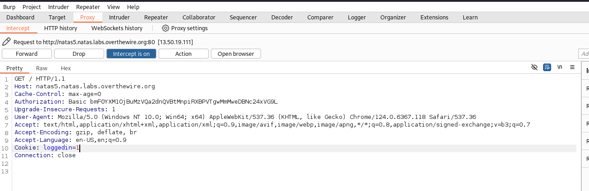

## Name: Natas Level 5 → Level 6

password:username ->
natas6:0RoJwHdSKWFTYR5WuiAewauSuNaBXned

## The trick
When you access Natas 5, you'll typically find that you are "not logged in." By inspecting the HTTP response (e.g., using browser developer tools or curl -i), you'll likely observe a Set-Cookie header that sets a cookie like loggedin=0.

The goal is to trick the application into thinking you are logged in. The vulnerability is that the application trusts the loggedin cookie value. By changing the value of the loggedin cookie from 0 to 1, you can bypass the login check and access the next level.

This is a classic example of a client-side enforcement vulnerability, where security decisions are made based on data controlled by the user, rather than being properly validated on the server side.

## Vulnarability: cookie manipulation

First we are prompted to a web page saying the following:

We can intercept the traffic with burpsuite to change some infromation.

Change Cookie loggedin=0 -> Cookie loggedin=1 and forward the traffic.

This will give us the password for natas6.

## Mitigation: 
Mitigate by implementing server-side session management that securely stores user authentication status, never relying on client-controlled cookie values for security decisions.
