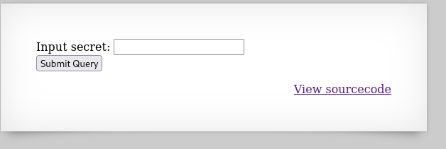
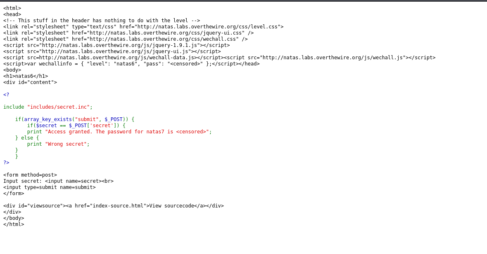
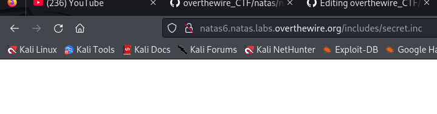
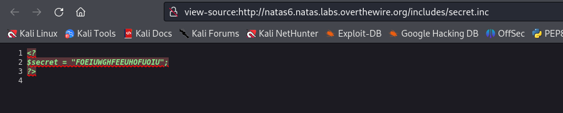
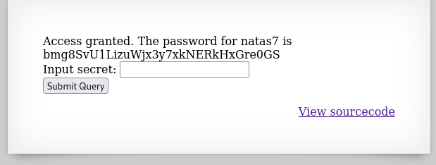

## Name: Natas Level 6 → Level 7

password:username ->
natas7:bmg8SvU1LizuWjx3y7xkNERkHxGre0GS  

## The trick
When you view the source code of Natas 6, you'll see a PHP include statement that pulls in a file: include "includes/secret.inc";. This means the application is including content from another file into the current page.

The vulnerability arises because the secret.inc file is directly accessible via the web server. By navigating your browser (or using curl) directly to 

## Vulnarability:  Local File Inclusion (LFI) & information disclosure.

First we get a look at the web page with the source code:

The webpage

The sourcecode

We can see the source code includes a directory  "includes/secret.inc" we can take a look at the directory and look at secret.inc.

Theres nothing much on the surface lets look at the source code!

Voilaa, we see the secret and can input it for the password of natas7

## Mitigation: 
To mitigate the Natas 6 vulnerability, sensitive files containing secrets, configuration data, or any information not intended for public access must be stored outside the web root directory. This prevents direct URL access. Instead, the application should include these files using a secure, absolute file path or through an internal, server-side mechanism that does not expose the file's content to the client, ensuring that the web server will not serve them directly.

