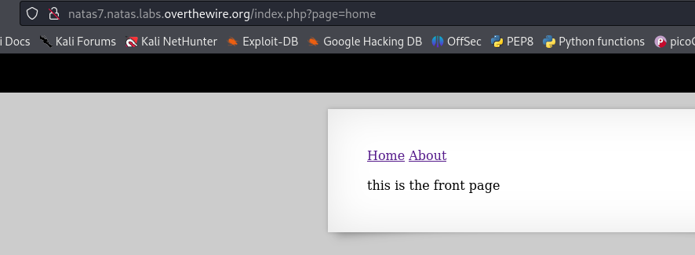
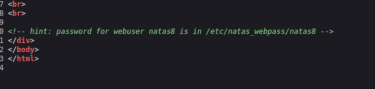
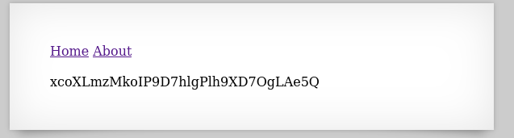

## Name: 

password:username ->
natas8:

## The Trick: 
When you interact with Natas 7, you'll see links like "Home" and "About" that modify the URL, typically looking something like index.php?page=home or index.php?page=about. This indicates that the application is taking the value of the page parameter and likely using it in a file inclusion function (e.g., include($_GET['page']) in PHP).

The key is that the application does not properly validate or sanitize the page parameter. This allows you to use directory traversal sequences (like ../) to access files outside the intended web root.

## Vulnarability: Local File Inclusion (LFI) & directory traversal (or path traversal)

First we see a clickable menu to home and about. When we click the buttons we see 

Lets look at the source code to see if theres any more information.

Here we are told that the password for natas9 is in "/etc/natas_webpass/natas8"

We can take this path and change this section of the URL index.php?page=home -> index.php?page=/etc/natas_webpass/natas8 

This will output the password onto the screen

## Mitigation: 
To mitigate Local File Inclusion (LFI) vulnerabilities, especially those involving directory traversal, all user-supplied input used in file inclusion functions must be strictly validated and sanitized on the server-side. This means implementing a "whitelist" approach, allowing only a predefined, limited set of safe filenames or identifiers to be included, rather than attempting to filter out malicious characters like ../. Additionally, critical files and configurations should be stored outside the web root, and the application should use absolute, hardcoded paths for file inclusions whenever possible, avoiding dynamic construction from user input.
