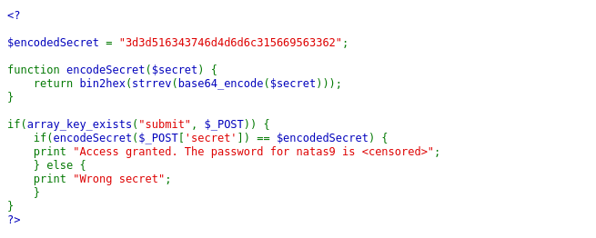
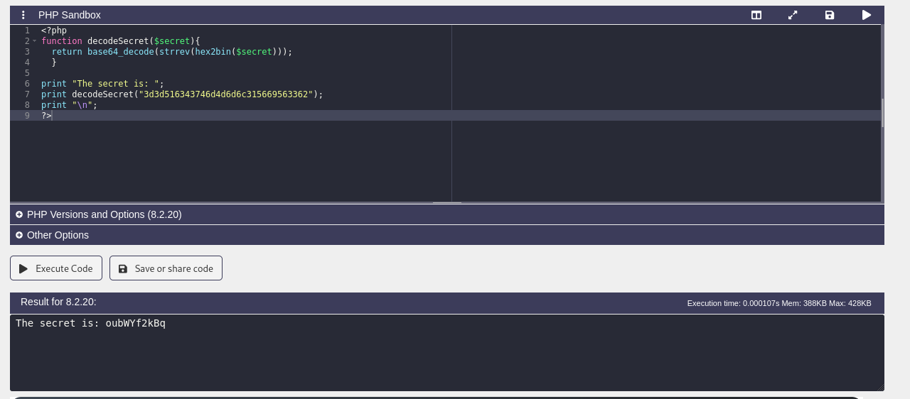
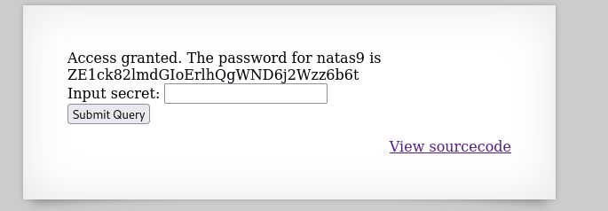

## Name: Natas Level 8 → Level 9

password:username ->
natas9:ZE1ck82lmdGIoErlhQgWND6j2Wzz6b6t 

## The Trick
When you examine the source code for Natas 8, you'll find a function, encodeSecret, and a predefined $encodedSecret variable. The application expects you to submit the original secret, which it then encodes using encodeSecret and compares to $encodedSecret.

The encodeSecret function performs a series of encoding steps in a specific order:

    base64_encode($secret)
    strrev(...) (string reverse)
    bin2hex(...) (binary to hexadecimal)

The $encodedSecret variable on the server is the result of these three steps applied to the actual secret for Natas 9. To get the password, you need to reverse these encoding steps in the exact opposite order on the provided $encodedSecret.

## Vulnarability: misunderstanding and reversing a multi-stage encoding scheme

First lets take a look at the source code!

Now we will reverse engineer the secret by reversing the processe!

In the .php script thats in the natas9 directory, it will decode the secret for us.
You can run this code inside a php sandbox (https://onlinephp.io/).

This will output the secret for us

Then input the secret into the prompt and voila the password for natas9!

## Mitigation: Dont leave your passwords in the source code, it's a bit oubious.
