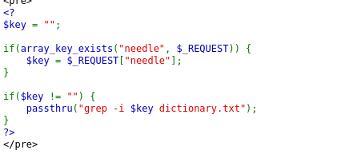
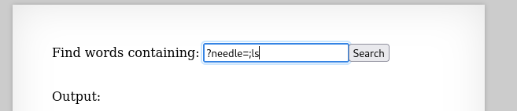
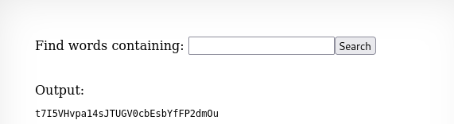

## Name: Natas Level 9 → Level 10

password:username ->
natas10:t7I5VHvpa14sJTUGV0cbEsbYfFP2dmOu

## The Trick
The trick is to use shell metacharacters to break out of the intended command and execute an arbitrary command. For example, if the backend command is grep [YOUR_INPUT] dictionary.txt, and you input x; cat /etc/natas_webpass/natas10, the server would execute: grep x; cat /etc/natas_webpass/natas10 dictionary.txt. The grep x command would run, and then the ; acts as a command separator, allowing cat /etc/natas_webpass/natas10 to execute, revealing the password for the next level.

In our case we our using "needle"

## Vulnarability: 

First lets look at the sourcecode to see whats vulnrable!

    User-Controlled Input: The $key variable directly takes user input from the needle parameter (via $_REQUEST).
    Direct Execution without Sanitization: The passthru() function is used to execute a shell command: grep -i $key dictionary.txt. The value of $key is inserted directly into this command string without any form of sanitization, escaping, or validation.

This lack of input validation allows us to inject shell metacharacters (like ;, |, &&, ||, &, etc.) into the needle parameter. When the passthru() function executes the command, these injected characters will be interpreted by the shell, allowing the attacker to execute arbitrary commands on the server alongside or instead of the intended grep command.

Means we can append a shell command separator (like ;) followed by the desired command. 

EXP: 
1. needle=;ls 
2. ?needle=;cat .htpasswd
3. ?needle=;cat /etc/passwd

This will show list the files in the current directory whcih is "dictionary.txt".

We know the password is in /etc/natas_webpass/natas10

We can use this method to output the password. "?needle=;cat /etc/natas_webpass/natas10" this also works with alot of other commands such as 

"grep -i .; cat /etc/natas_webpass/natas10 dictionary.txt"

The grep -i . command would run (searching for any character, which typically works and produces output), and then the ; separator would allow the cat /etc/natas_webpass/natas10 command to execute, printing the password to the screen.

## Mitigation: 
