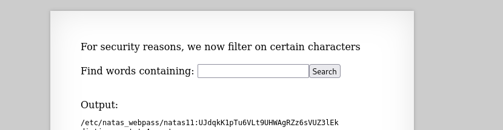

## Name: Natas Level 10 → Level 11

password:username ->
natas11:UJdqkK1pTu6VLt9UHWAgRZz6sVUZ3lEk

## The Trick
Natas10 typically features a command injection vulnerability, where the web application uses user-supplied input directly within a system command without proper sanitization. This allows an attacker to inject shell metacharacters (like ;, |, &&) and append arbitrary commands to the original command. When the server executes this combined string, the injected commands are also run, potentially leading to remote code execution, information disclosure (such as reading the password file for the next level), or further system compromise.

You can use "u" to bypass this -> "u /etc/natas_webpass/natas11"

## Vulnarability: command injection

We can input "u /etc/natas_webpass/natas11"
This will ouput the password for natas11

## Mitigation: 
