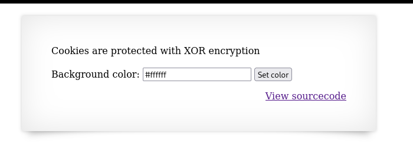
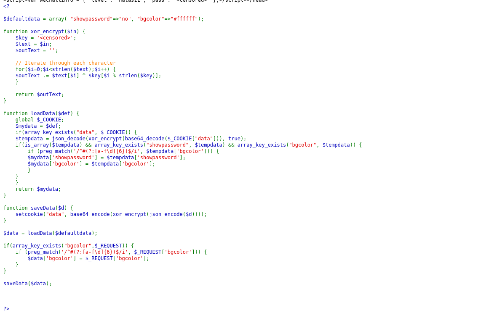
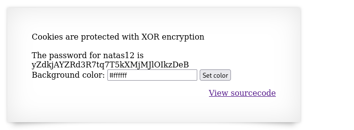

## Name: Natas Level 11 → Level 12

password:username ->
natas12:yZdkjAYZRd3R7tq7T5kXMjMJlOIkzDeB

## The Trick

Natas11's vulnerability stems from its use of predictable XOR encryption for session cookies, allowing a known-plaintext attack. The website encrypts cookie data (like {"showpassword":"no", "bgcolor":"#ffffff"}) with a consistent XOR key. By knowing both the original plaintext and the encrypted ciphertext from the cookie, an attacker can easily derive the secret XOR key. Once the key is recovered, they can then craft a malicious plaintext (e.g., {"showpassword":"yes", ...}), encrypt it with the retrieved key, and send it back to the server, which will then decrypt and process the forged instruction, revealing the password for the next level.

## Vulnarability: Weak Cryptographic Implementation & Known-Plaintext Attack & Improper Handling of Sensitive Data (Sensitive Data Exposure)

Here is the web page (Hints that its zor encrypted)

More details on how to break the encryption here (https://en.wikipedia.org/wiki/XOR_cipher)

First lets look at the source code

Let's break down the code and its vulnerabilities:

1. defaultdata Array:
PHP

$defaultdata = array( "showpassword"=>"no", "bgcolor"=>"#ffffff");

This array defines the default values for user preferences: showpassword is initially "no", and bgcolor is "#ffffff" (white). This array is critical to the vulnerability because it represents a "known plaintext." An attacker can reliably assume this is the initial data structure that gets encrypted.

2. xor_encrypt Function:
PHP

function xor_encrypt($in) {
    $key = '<censored>';
    $text = $in;
    $outText = '';

    // Iterate through each character
    for($i=0;$i<strlen($text);$i++) {
        $outText .= $text[$i] ^ $key[$i % strlen($key)];
    }

    return $outText;
}

This function implements a simple XOR cipher.

    $key = '<censored>';: This is the secret key used for encryption. The problem is that XOR is not a robust encryption algorithm on its own, especially with a known key length (implied by the <censored> placeholder) and without additional cryptographic techniques.
    $outText .= $text[$i] ^ $key[$i % strlen($key)];: Each character of the input text is XORed with a character from the key. The key is repeated if it's shorter than the text ($i % strlen($key)).

The Core Vulnerability:
The fundamental flaw here is the susceptibility to a known-plaintext attack.

    XOR Property: One of the properties of XOR is that A ^ B = C implies A ^ C = B and B ^ C = A. In cryptography, this means if you know the plaintext (A) and the ciphertext (C), you can derive the key (B) by performing Plaintext ^ Ciphertext = Key.
    Exploitation: An attacker can observe the data cookie when it contains the default values (e.g., by clearing their cookies and reloading the page). The defaultdata array, when JSON-encoded, forms the plaintext: {"showpassword":"no","bgcolor":"#ffffff"}. The value of the data cookie (after Base64 decoding) is the ciphertext. By XORing the known plaintext with this observed ciphertext, the attacker can recover the secret $key.

3. loadData Function:
PHP

function loadData($def) {
    global $_COOKIE;
    $mydata = $def;
    if(array_key_exists("data", $_COOKIE)) {
        $tempdata = json_decode(xor_encrypt(base64_decode($_COOKIE["data"])), true);
        if(is_array($tempdata) && array_key_exists("showpassword", $tempdata) && array_key_exists("bgcolor", $tempdata)) {
            if (preg_match('/^#(?:[a-f\d]{6})$/i', $tempdata['bgcolor'])) {
                $mydata['showpassword'] = $tempdata['showpassword'];
                $mydata['bgcolor'] = $tempdata['bgcolor'];
            }
        }
    }
    return $mydata;
}

This function is responsible for retrieving and decrypting user preferences from the data cookie.

    base64_decode($_COOKIE["data"]): The cookie value is first Base64 decoded.
    xor_encrypt(...): Then, the XOR decryption is performed using the same xor_encrypt function (since XOR is its own inverse, applying it twice with the same key decrypts the data).
    json_decode(..., true): The decrypted string is then JSON decoded into an associative array.
    Validation: There's a preg_match check for bgcolor to ensure it's a valid hex color code (/^#(?:[a-f\d]{6})$/i). While this is good for preventing arbitrary string injection into the bgcolor field, it does not protect against manipulating other fields like showpassword, which is the target in challenges like Natas. The vulnerability lies in the decryption itself, not the input validation after decryption.

4. saveData Function:
PHP

function saveData($d) {
    setcookie("data", base64_encode(xor_encrypt(json_encode($d))));
}

This function saves the preferences back into the data cookie.

    json_encode($d): The preferences array is JSON encoded.
    xor_encrypt(...): The JSON string is then XOR encrypted.
    base64_encode(...): Finally, it's Base64 encoded before being set as a cookie.

5. Main Logic Flow:
PHP

$data = loadData($defaultdata);

if(array_key_exists("bgcolor",$_REQUEST)) {
    if (preg_match('/^#(?:[a-f\d]{6})$/i', $_REQUEST['bgcolor'])) {
        $data['bgcolor'] = $_REQUEST['bgcolor'];
    }
}

saveData($data);

This is the script's execution flow:

    It loads the existing data from the cookie or uses defaults.
    It checks if a bgcolor parameter is provided in the request ($_REQUEST).
    If bgcolor is present and valid, it updates the $data array.
    Crucially, it calls saveData($data), which re-encrypts and re-encodes the entire $data array (including showpassword) and sets it back into the cookie.
Using the script "script.php" you can find your xor secret key make your cookie and upload it via your webtools in your browser or with burpsuite. 
This will give us the password for natas12!

## Mitigation: 
To mitigate the Natas11 vulnerability, the primary step is to avoid custom, insecure encryption like XOR for sensitive data in cookies. Instead, leverage PHP's built-in, cryptographically secure session management, which stores session data server-side and only sends a non-guessable session ID to the client via a cookie. Furthermore, always use HTTPS to encrypt all traffic, enable the HttpOnly cookie flag to prevent client-side script access, and utilize the Secure cookie flag to ensure cookies are only sent over HTTPS, significantly reducing the risk of cookie theft and manipulation.

