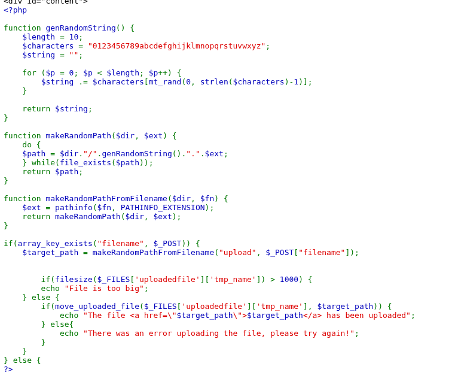
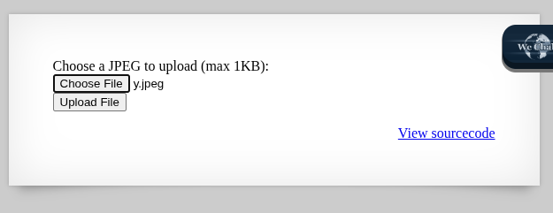
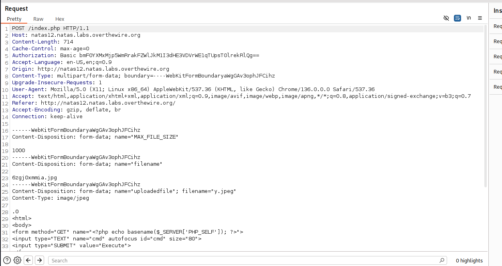
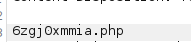
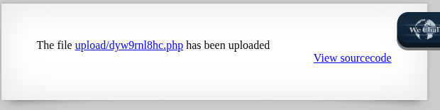
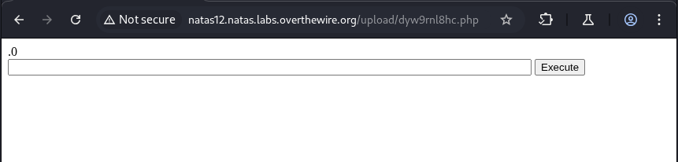
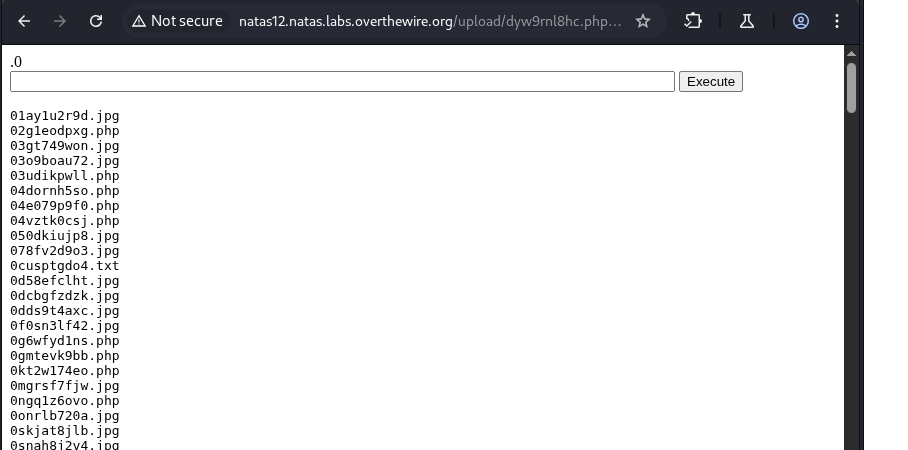
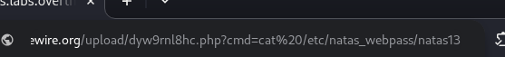
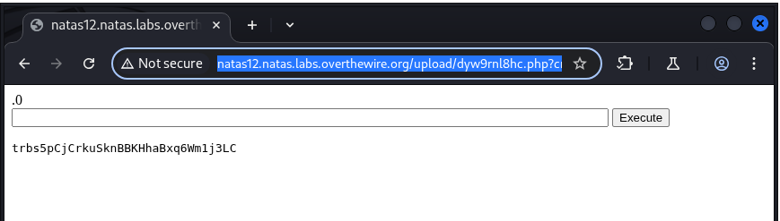

## Name: Natas Level 12 → Level 13

password:username ->
natas13:trbs5pCjCrkuSknBBKHhaBxq6Wm1j3LC

## The Trick: 

The core trick in Natas12 is to bypass the web application's assumed file type filtering for uploads. Although the challenge presents an image upload feature, the server-side code likely only checks the file extension of the uploaded file name provided by the user. This means you can upload a PHP file containing a simple webshell, like <?php passthru($_GET['cmd']); ?>, while still manipulating the provided filename to appear as if it has an image extension (e.g., image.php). Once uploaded, you can then directly access this PHP file via its URL on the server and use the cmd GET parameter to execute arbitrary commands, ultimately allowing you to read the password for the next level.

## Vulnarability: file upload with an insecure file extension filter, leading to remote code execution.

First lets look at the code

    La requête a abouti

This PHP code is for a file upload system. Here's a simple explanation and why it's vulnerable:

What it does:

    genRandomString(): Creates a random 10-character string using numbers and lowercase letters.
    makeRandomPath($dir, $ext): Generates a unique filename for an uploaded file. It combines a random string, a directory ($dir), and a file extension ($ext). It keeps trying until it finds a filename that doesn't already exist.
    makeRandomPathFromFilename($dir, $fn): This is the crucial part. It takes the original filename ($fn) that the user provided (e.g., "myimage.jpg") and extracts only the extension (e.g., "jpg") using pathinfo($fn, PATHINFO_EXTENSION). It then uses this extracted extension to create the new random path.
    Main Upload Logic:
        Checks if a "filename" was submitted in the form.
        Generates the $target_path using makeRandomPathFromFilename, meaning the new, random filename will end with the extension extracted from the user's original filename.
        Checks if the uploaded file is larger than 1000 bytes (0.97 KB).
        If the file size is okay, it moves the uploaded file from its temporary location to the $target_path.

Why it's vulnerable:

The vulnerability lies in how the makeRandomPathFromFilename function determines the file's extension. It simply takes the extension from the user-provided filename, without any validation or whitelisting of allowed extensions.

This means:

    You can upload a PHP file directly: If you name your file shell.php, the code will extract .php as the extension, generate a random filename like ajkdlf123.php, and then save your malicious PHP file with a .php extension on the server.
    Remote Code Execution: Once your .php file (containing a webshell, for example) is uploaded, you can then access it via a web browser. Since it's a PHP file, the web server will execute its code, allowing you to run arbitrary commands on the server.

In essence, the code blindly trusts the file extension provided by the user, leading to a critical flaw where an attacker can upload and execute server-side scripts.

Then lets try to upload our payload to the webserver with burpsuite.

Change the .jpeg -> .php to get our shell.

Lets click on our upload file 

We have a shell!

Lets us ls to list all files in the current directory!

Lets get our password: 

Make sure you put the payload in the url, should look like this = http://natas12.natas.labs.overthewire.org/upload/dyw9rnl8hc.php?cmd=cat%20/etc/natas_webpass/natas13

And we get our password

## Mitigation: 
To mitigate file upload vulnerabilities like the one in Natas12, a multi-layered security approach is essential. First, never rely solely on client-side validation for file extensions or MIME types, as these can be easily bypassed. Implement server-side validation that uses an allow-list (whitelist) of explicitly permitted file extensions (e.g., .jpg, .png, .gif for images) rather than a blacklist. Additionally, validate the actual file content (e.g., using getimagesize() for images) to ensure it truly matches the expected file type, preventing malicious files from masquerading as legitimate ones. Finally, store uploaded files outside of the web root directory to prevent direct execution via URL, and rename uploaded files with unique, non-guessable names to avoid overwriting existing files or enabling path traversal attacks.
