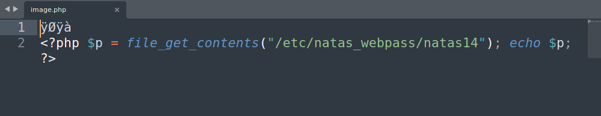
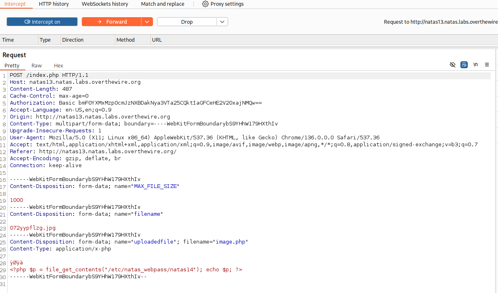
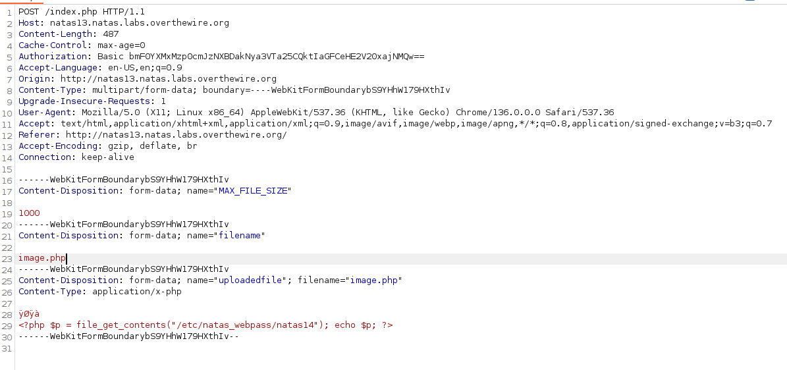
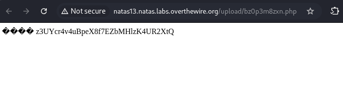

## Name: Natas Level 13 → Level 14

password:username ->
natas14:z3UYcr4v4uBpeX8f7EZbMHlzK4UR2XtQ

## The Trick: 

Craft a malicious PHP file, that allows for arbitrary command execution.
Add image magic bytes: Prepend the PHP script with the magic bytes of an image format (e.g., \xff\xd8\xff for JPEG). This makes the file look like a valid image to the server's validation.
Upload the crafted file: Upload this "polyglot" file to the server.
Locate the uploaded file: Determine the URL or path where the uploaded file is stored.
Execute commands: Access the uploaded file via its URL and pass commands as a GET parameter (e.g., http://natas13.natas.labs.overthewire.org/upload/your_file.php?cmd=cat+/etc/natas_webpass/natas14). This will execute the PHP code and display the output of the command.

## Vulnarability: File Upload Functionality & Insufficient File Type Validation & Bypass with Magic Bytes (File Signature) & Directory Traversal/Path Disclosure

Lets look at the source code shall we :)

Trusting the User-Provided Filename for Extension Determination:

    Code:
    PHP

    function makeRandomPathFromFilename($dir, $fn) {
        $ext = pathinfo($fn, PATHINFO_EXTENSION);
        return makeRandomPath($dir, $ext);
    }
    // ...
    $target_path = makeRandomPathFromFilename("upload", $_POST["filename"]);

    Explanation of Vulnerability: This is arguably the most critical component. The makeRandomPathFromFilename function extracts the file extension directly from the $_POST["filename"] parameter. This means an attacker can provide an arbitrary filename with an arbitrary extension (e.g., shell.php). The server will then attempt to save the uploaded file with this user-controlled extension. If the attacker wants to execute code, they will choose a server-side executable extension like .php, .phtml, .asp, etc.
    Why it's "Valuable" for the Attacker: It allows the attacker to dictate the file's extension, which is crucial for getting the web server to interpret the uploaded file as executable code rather than just a static file.

Insufficient File Type Validation using exif_imagetype():

    Code:
    PHP

    else if (! exif_imagetype($_FILES['uploadedfile']['tmp_name'])) {
        echo "File is not an image";
    }

    Explanation of Vulnerability: exif_imagetype() checks the "magic bytes" (the first few bytes of a file that identify its format) to determine if a file is an image. However, it only looks at these initial bytes. It doesn't analyze the entire file content for executable code.
    Why it's "Valuable" for the Attacker: This specific function allows for a magic byte bypass. An attacker can craft a file that starts with valid image magic bytes (e.g., GIF89a; for a GIF image) followed immediately by malicious PHP code. exif_imagetype() will see the valid GIF header and pass the check, believing it's a legitimate image. However, when the file is later accessed, the web server (if configured to execute .php files) will ignore the image header and execute the PHP code that follows.

File Size Limit (1000 bytes):

    Code:
    PHP

    else if(filesize($_FILES['uploadedfile']['tmp_name']) > 1000) {
        echo "File is too big";
    }

    Explanation of Vulnerability (or lack thereof): While this is a security control, it's not a strong one against this type of attack. 1KB is usually more than enough to include a simple PHP shell and the necessary magic bytes. It primarily serves to prevent denial-of-service by uploading excessively large files, but it doesn't prevent code execution.
    Why it's "Valuable" for the Attacker (in a perverse way): It forces the attacker to be concise with their payload, but it doesn't prevent the core vulnerability.

Displaying the Uploaded File Path:

    Code:
    PHP

if(move_uploaded_file($_FILES['uploadedfile']['tmp_name'], $target_path)) {
    echo "The file <a href=\"$target_path\">$target_path</a> has been uploaded";
}

Explanation of Vulnerability: This directly reveals the full path to the uploaded file to the attacker. Without this, the attacker would have to guess the filename (which is randomly generated) and the directory, making exploitation much harder.
Why it's "Valuable" for the Attacker: It provides immediate feedback on the successful upload and, more importantly, gives the exact URL needed to access and execute the malicious PHP file. This significantly streamlines the exploitation process.

First lets craft our pyaload! We add the magic bytes of the jpeg to the .php payload to trick the server into thinking its an image.

With burp suite intercept the payload while you upload it

Change the name of the payload to the original name in my case "image.php".

Upload it to the server and visit the link and voila you have the password. 

## Mitigation: 

