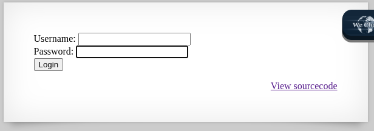
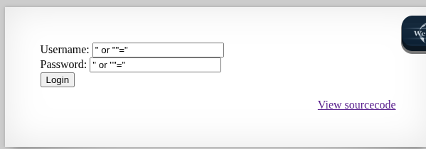
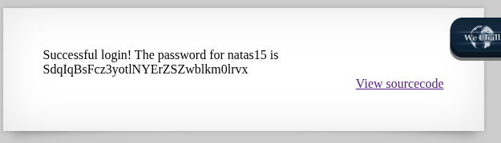

## Name: Natas Level 14 → Level 15

password:username ->
natas15:SdqIqBsFcz3yotlNYErZSZwblkm0lrvx

## The Trick: 

Natas 14 demonstrates a classic SQL Injection vulnerability where a web application directly incorporates user input into an SQL query without proper sanitization. This allows an attacker to inject malicious SQL code. The injected code then manipulates the original query, often causing the database to return all records or bypass authentication, highlighting the critical need for developers to use parameterized queries or prepared statements to prevent user input from being interpreted as executable code.

## Vulnarability: SQL injection

The source code

The login page

Our payloads we can do

1. " or 1 = 1 #
2. " or 1=1 -- -
3. " or ""="

The password!

## Mitigation: 
Mitigating SQL injection, as demonstrated by Natas 14, primarily involves implementing parameterized queries (prepared statements), which treat user input as data rather than executable code, preventing malicious SQL from altering query logic. This should be coupled with rigorous input validation, especially whitelist validation on the server-side, to ensure only expected and safe data formats are processed. Additionally, enforcing the principle of least privilege for database users and displaying only generic error messages further limits potential damage from successful attacks, while a Web Application Firewall (WAF) can offer an extra layer of defense against known attack patterns.

