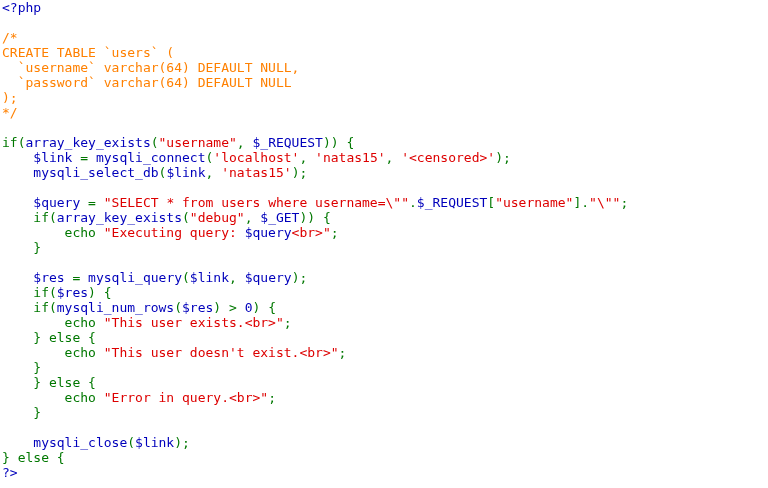

## Name: Natas Level 15 → Level 16

password:username ->
natas16:hPkjKYviLQctEW33QmuXL6eDVfMW4sGo

## The Trick: 

Natas 15 features a Blind SQL Injection vulnerability, stemming from the direct concatenation of user-supplied input (the username parameter) into an SQL query. Unlike Natas 14, where a successful injection might directly display data, Natas 15 only provides a boolean response ("This user exists." or "This user doesn't exist."). This requires an attacker to use timing-based or boolean-based techniques to infer information character by character from the database. By injecting SQL that creates a true/false condition or a time delay, an attacker can determine if specific characters or conditions hold true within the database, ultimately allowing them to extract sensitive data like passwords, even without direct error messages or result set display.

## Vulnarability: blind SQL injection

The source code

The core of the vulnerability lies in this line:
PHP

$query = "SELECT * from users where username=\"".$_REQUEST["username"]."\"";

Here, the value of $_REQUEST["username"] (which can come from either $_GET or $_POST) is directly concatenated into the SQL query string without any sanitization or use of parameterized queries. This is the classic recipe for SQL injection.

I made a script called natas15.py run it - > "python3 natas15.py" it will bruteforce the password for us.

The password!

## Mitigation: 
To mitigate the Natas 15 vulnerability, the primary defense is to employ prepared statements with parameterized queries. This involves defining the SQL query structure with placeholders for dynamic values, then binding user input to these placeholders separately, ensuring the database treats the input as literal data rather than executable code. Additionally, implementing strict input validation (especially whitelisting allowed characters/formats) and using the principle of least privilege for database user accounts can further reduce the attack surface and potential impact.

