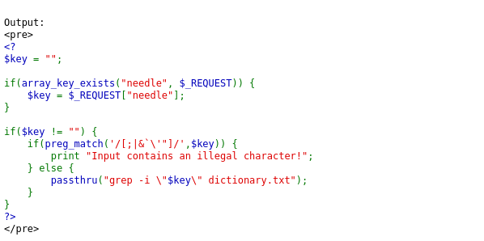
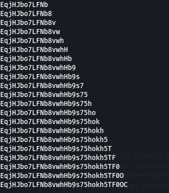

## Name: Natas Level 16 → Level 17

password:username ->
natas17:EqjHJbo7LFNb8vwhHb9s75hokh5TF0OC

## Vulnarability: command injection through blacklist bypass
Use the script I provided called "natas16.py" to crack the password for natas17

### The source code

### Explenation:
Here's the breakdown:

    passthru("grep -i \"\$key\" dictionary.txt");: The code directly executes a shell command (grep) and inserts the user-supplied $key variable into it. This is the root cause of the command injection vulnerability, as it allows user input to be interpreted as part of the command.

    **Incomplete Blacklist (preg_match('/[;|&']/',$key))**: Thepreg_matchfunction attempts to filter out "illegal characters" like;,|,&, `` `` (backtick), and '. However, this blacklist is insufficient. It misses several critical characters and techniques that can still be used to inject and execute arbitrary commands.

Specifically, the blacklist fails to filter:

    Command Substitution ($()): Characters like $ (dollar sign), ( (parenthesis), and ) (parenthesis) are not filtered. This allows an attacker to use shell command substitution (e.g., $(command)) to execute arbitrary commands, where the output of the inner command is then used as part of the grep command. For example, needle=$(cat /etc/natas_webpass/natas17) would execute cat /etc/natas_webpass/natas17 and insert its output into the grep command.
    Newline Character (%0a or \n): A newline character can be used to terminate one command and start another. This is often not explicitly blacklisted and can be used for multi-command execution.
    Other Shell Metacharacters: Depending on the shell, other characters like <, >, &&, || might also be exploitable if not properly handled, though the primary immediate bypass here is command substitution.

In essence, the vulnerability is command injection through a blacklist bypass because the implemented filter is not comprehensive enough to prevent all forms of shell metacharacter interpretation when user input is passed directly to passthru().

### The script running
to run the script

    python3 natas16.py
    

## Mitigation: 
To effectively mitigate command injection vulnerabilities that bypass blacklists, the most critical step is to shift from a blacklist approach to a whitelist approach. Instead of trying to filter out every potentially malicious input, only explicitly allow inputs that are known to be safe and conform to a strict, predefined format, such as alphanumeric characters for filenames. When external commands absolutely must be executed, always use safe API functions that separate the command from its arguments, preventing the operating system shell from interpreting user-supplied input as executable code. Furthermore, ensure your applications operate with the least possible privileges to minimize the impact if an injection were to occur, and implement robust input validation at all entry points to verify data types, lengths, and character sets.
